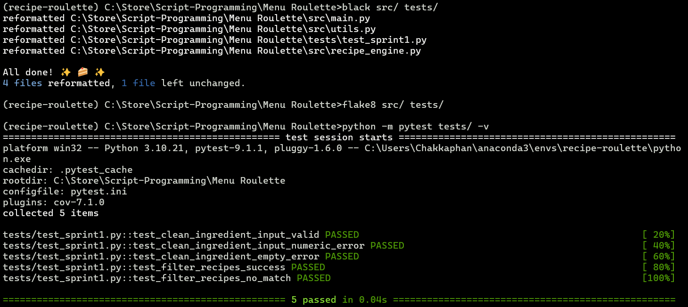

# Sprint 1 Quality Assurance Report

**Project**: Recipe Roulette  
**Lead QA**: Khong  

### Edge Case Test Results

| Test Case | Input | Expected Output | Actual Output | Status |
| :--- | :--- | :--- | :--- | :--- |
| Empty Input | `"   "` | Throw `InvalidIngredientError` | Exception caught gracefully | PASSED |
| Numeric Input | `"pork123, egg"` | Reject input with warning | `InvalidIngredientError` raised | PASSED |
| Special Chars | `"pork!!, egg?"` | Strip symbols to `['pork', 'egg']` | `['pork', 'egg']` returned | PASSED |
| No Match | `"chocolate"` | Return match count `0` and `None` | `match_count: 0, selected_recipe: None` | PASSED |

### Retrospective (Wow! & Whoops!)
- **Wow!**: Base engine pipeline runs completely decoupled from UI, making pytest mocking fast and reliable.
- **Whoops!**: Initial regex stripped valid inner spaces in multi-word ingredients (e.g., "soy sauce" became "soysauce"). Fixed by refining regex in `utils.py`.