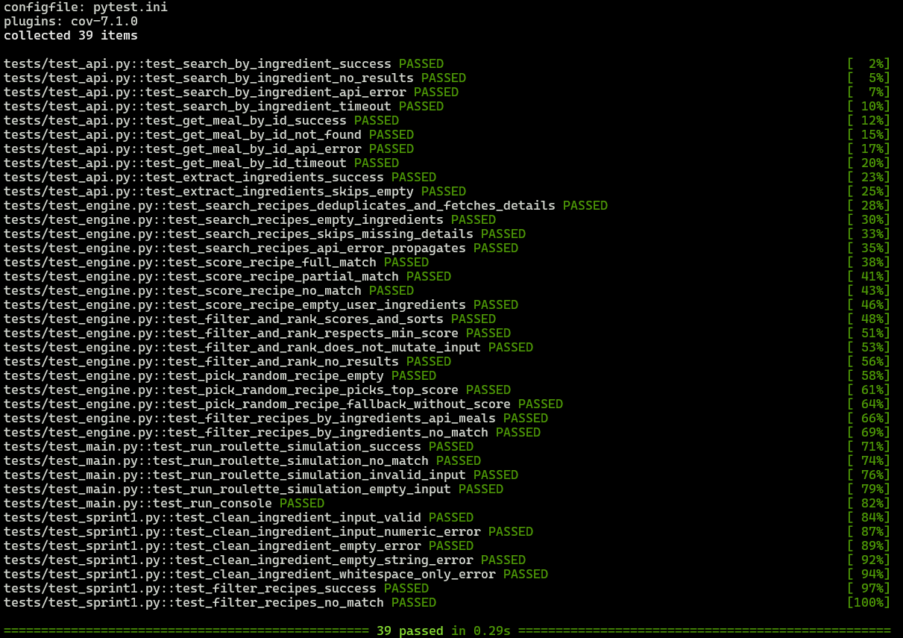

# Sprint 2 Quality Assurance Report

**Project**: Recipe Roulette  
**Lead QA**: Ter

### Edge Case Test Results

| Test Case | Input | Expected Output | Actual Output | Status |
| :--- | :--- | :--- | :--- | :--- |
| API Search Success | `search_by_ingredient("chicken")` | 2 meals with `idMeal` `52772`, `52968` | 2 meals returned, first `52772` | PASSED |
| API No Results | `search_by_ingredient("avocado")` | `[]` | `[]` returned | PASSED |
| API HTTP Error | `search_by_ingredient("chicken")` (status 500) | Raise `APIError` | `APIError` raised | PASSED |
| API Timeout | `search_by_ingredient("chicken")` (`Timeout`) | Raise `APIError` | `APIError` raised | PASSED |
| Meal Lookup Success | `get_meal_by_id("52772")` | Meal dict with `strMeal` "Teriyaki Chicken Casserole" | Valid dict returned | PASSED |
| Meal Not Found | `get_meal_by_id("99999")` (`meals: null`) | `None` | `None` returned | PASSED |
| Meal Lookup HTTP Error | `get_meal_by_id("52772")` (status 500) | Raise `APIError` | `APIError` raised | PASSED |
| Meal Lookup Timeout | `get_meal_by_id("52772")` (`Timeout`) | Raise `APIError` | `APIError` raised | PASSED |
| Ingredient Extraction | Meal with `chicken`, `soy sauce`, `garlic` | List of 3 non-empty ingredients | `["chicken", "soy sauce", "garlic"]` returned | PASSED |
| Ingredient Extraction Skips Empty | Meal with `strIngredient4: ""` | No empty strings in result | `""` excluded | PASSED |
| Search Dedup | `["chicken", "pork"]` (same meal in both) | Unique meals, `get_meal_by_id` called once per ID | 2 unique meals, 2 calls | PASSED |
| Search Empty Input | `search_recipes([])` | `[]` without API call | `[]`, API not called | PASSED |
| Search Missing Details | Meal with `idMeal "99999"` returning `None` | Details skipped | `[]` returned | PASSED |
| Search API Error | `search_recipes(["chicken"])` raising `APIError` | Error propagates | `APIError` raised | PASSED |
| Full Match Score | `score_recipe(meal, ["chicken", "rice"])` | `1.0` | `1.0` returned | PASSED |
| Partial Match Score | `score_recipe(meal, ["chicken", "pork"])` | `0.5` | `0.5` returned | PASSED |
| No Match Score | `score_recipe(meal, ["avocado"])` | `0.0` | `0.0` returned | PASSED |
| Empty User Ingredients Score | `score_recipe(meal, [])` | `0.0` (no divide-by-zero) | `0.0` returned | PASSED |
| Rank Sorted Descending | `filter_and_rank(["chicken", "rice"])` | Scores sorted high → low | Sorted descending | PASSED |
| Min Score Filter | `filter_and_rank(["chicken", "rice", "pork"], min_score=1.0)` | Only scores ≥ 1.0 | `[]` (none qualify) | PASSED |
| Rank Does Not Mutate Input | `filter_and_rank(["pork"])` | Original dicts keep no `score` key | No mutation | PASSED |
| Rank No Results | `filter_and_rank(["avocado"])` | `[]` | `[]` returned | PASSED |
| Pick Top Score | 2 recipes at `1.0`, 1 at `0.5` | Pick from top-scored group only | Picked score `1.0` (`idMeal` `2` or `3`) | PASSED |
| Pick Empty List | `pick_random_recipe([])` | `None` | `None` returned | PASSED |
| Pick Legacy Data Fallback | Meals without `score` key | Plain random choice | Meal returned | PASSED |

### CI/CD Workflow (`.github/workflows/test.yml`)
- Push / Pull Request to `main` and `develop` triggers `pytest -v` on Ubuntu (Python 3.11).
- All **39 tests passed in 0.29s** (`test_api.py` 10, `test_engine.py` 19, `test_main.py` 6, `test_sprint1.py` 4).

### Retrospective (Wow! & Whoops!)
- **Wow!**: Full HTTP mocking via `unittest.mock` makes API tests fast and deterministic without hitting TheMealDB — network calls and timeouts are covered without flaky behavior.
- **Whoops!**: Early engine tests relied on mock dicts with an `ingredients` key, but live API meals use `strIngredient1..20`; `filter_recipes_by_ingredients` needed a normalization layer (`_recipe_ingredients`) so both mock and live data pass. Fixed and covered by dedicated tests.